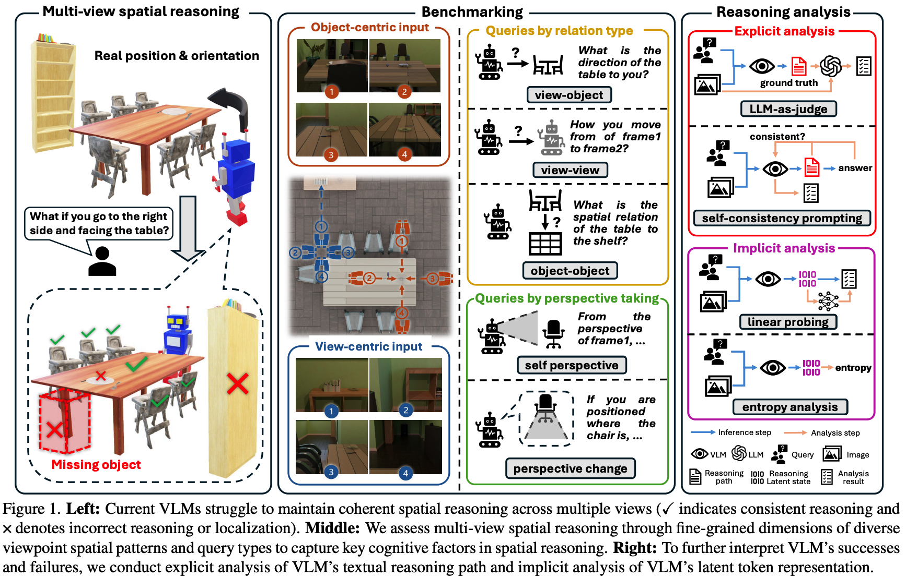
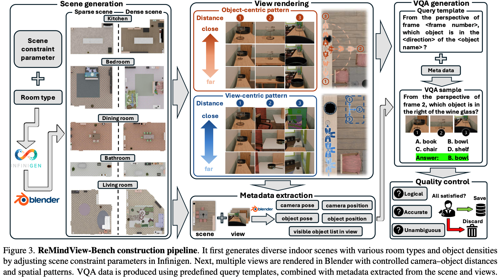

# Reasoning-Path-and-Latent-State-Analysis-for-Mulit-view-Visual-Spatial-Reasoning
This repository is the official implementation of paper: Reasoning Path and Latent State Analysis for Mulit-view Visual Spatial Reasoning: A Cognitive Science Perspective 

## The overview of ReMindView-Bench multiview spatial reasoning VQA generation pipeline: 

## News
- `2025/11/30`: We have released the code. 
 
## Quickstart
- Install Blender (headless is fine) and the Python deps used by Infinigen plus common packages. Run the scripts with Blender’s bundled Python or `blender --background --python <script> -- --flags` so `bpy` is available.
- From the repo root, generate scenes and renders: `bash scene_generation.sh`. The script sweeps seeds 0–9 across five room types and writes scenes to `outputs/indoors/<ROOM>_<SEED>`, object-centric frames to `object_centric_view_frame_outputs/<ROOM>/<ROOM>_<SEED>`, and view-centric frames to `view_centric_view_frame_outputs/<ROOM>/<ROOM>_<SEED>`.
- Clean empty/invalid views: `python clean_visual_data.py --dir_path object_centric_view_frame_outputs` and the same for `view_centric_view_frame_outputs`.
- Produce QA CSVs (choose one of `view_view`, `view_object`, `object_object`):  
  `python ground_truth_generation.py --image_folder object_centric_view_frame_outputs --qa_type object_object`  
  The output lands beside the image folder (e.g., `object_centric_view_frame_outputs/object_object_qa.csv`).

## Pipeline details
- `scene_generation.sh`: creates indoor scenes with `python -m infinigen_examples.generate_indoors`, then renders object-centric and view-centric frames via `object_centric_view_frame_generation.py` and `view_centric_view_frame_generation.py`. Camera/visibility configs live in `*_generation_config.json`.
- `generate_object_list.sh`: scans rendered frames and writes per-room object visibility summaries used later for QA construction.
- `ground_truth_generation.sh`: builds multiple-choice QA CSVs using visibility metadata, room/object rename maps in `object_rename/`, and templates in `query_template.json`. Use `--blender_dir_path` if scenes live outside `outputs/`, and `--rename_dir_path` to point to custom rename/orientation JSONs.

## Key files
- `scene_generation.sh` – end-to-end generation loop (seeds, room types, cleaning).
- `object_centric_view_frame_generation.py` / `view_centric_view_frame_generation.py` – camera placement and rendering logic.
- `ground_truth_generation.py` – QA generation entrypoint (supports cross-frame and perspective-changing questions).
- `object_centric_view_frame_generation_config.json`, `view_centric_view_frame_generation_config.json` – tunable rendering/visibility thresholds.
- `clean_visual_data.py`: drops frames with no visible objects and prunes empty directories.
- `object_rename/` – per-room rename and orientation metadata used to map Blender object ids to natural names.

## Notes
- Ensure `PYTHONPATH` includes this repo when running via Blender so `infinigen_examples` imports resolve.
- Rendering can be GPU-heavy; lower `samples` or resolution in the config JSONs for quicker iteration.
- The scripts delete intermediate frames without visible objects; if you need raw renders, disable `clean_visual_data.py` in your workflow.
